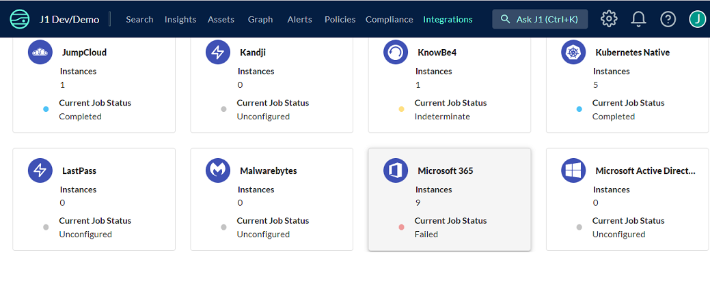

# Integration with JupiterOne

JupiterOne provides a managed integration for Microsoft 365. The integration
connects directly to Microsoft Graph APIs to obtain metadata about the target
organization and analyze resource relationships.

## Microsoft 365 + JupiterOne Integration Benefits

- Visualize Microsoft 365 services, groups, and users in the JupiterOne graph.
- Map Microsoft 365 users to employees in your JupiterOne account.
- Monitor changes to Microsoft 365 users using JupiterOne alerts.

## How it Works

- JupiterOne uses your configured credentials to periodically fetch acocunt
  information, users, groups, and group members from Microsoft 365 to update the
  graph.
- You write JupiterOne queries to review and monitor updates to the graph.
- You configure alerts to take action when JupiterOne graph changes.

## Requirements

- An Azure account with a registered app that will provide credentials for the
  program to connect to Microsoft Graph APIs.
- A Microsoft 365 account to target for ingestion.

## Support

If you need help with this integration, please contact
[JupiterOne Support](https://support.jupiterone.io).

## Integration Walkthrough

### In JupiterOne

1. From the configuration **Gear Icon**, select **Integrations**.

   

2. Scroll to the **Microsoft-365** integration tile and click it.

   

3. Click the **Add Configuration** button.

   

4. Enter the **Account Name** by which you'd like to identify this Microsoft 365
   account in JupiterOne. Ingested entities will have this value stored in
   `tag.AccountName` when **Tag with Account Name** is checked.
5. Enter a **Description** that will further assist your team when identifying
   the integration instance.
6. Select a **Polling Interval** that you feel is sufficient for your monitoring
   needs. You may leave this as `DISABLED` and manually execute the integration.
7. Select which **Scopes** you would like JupiterOne to be able to pull data
   for.
8. Click **Create Configuration** once all values are provided.

   
   

9. When prompted, click "Complete Offsite" in the dialog.

   

10. You will be directed to Microsoft's identity platform, where you must login
    in as an administrator in the Microsoft organization you intend to integrate
    with.

       

    NOTE: You must select a business account which are indicated by badge icons.
    If you select a personal account, you will recieve the below error messaage.

       

11. Review requested permissions and grant consent.

      

# How to Uninstall

1. From the configuration **Gear Icon**, select **Integrations**.
2. Scroll to the **Microsoft 365** integration tile and click it.
3. Identify and click the **integration to delete**.
4. Click the **trash can** icon.
5. Click the **Remove** button to delete the integration.

## Setup

Authorize access to JupiterOne:

1. Log in to JupiterOne as a user with permission to set up an integration
1. Add a Microsoft 365 integration instance
1. Once you have finished configuring your new instance, you will be directed to
   Microsoft's identity platform, where you must login in as an administrator in
   the organization you intend to integrate
1. Review requested permissions and grant consent

<!-- {J1_DOCUMENTATION_MARKER_START} -->
<!--
********************************************************************************
NOTE: ALL OF THE FOLLOWING DOCUMENTATION IS GENERATED USING THE
"j1-integration document" COMMAND. DO NOT EDIT BY HAND! PLEASE SEE THE DEVELOPER
DOCUMENTATION FOR USAGE INFORMATION:

https://github.com/JupiterOne/sdk/blob/master/docs/integrations/development.md
********************************************************************************
-->

## Data Model

### Entities

The following entities are created:

| Resources                       | Entity `_type`                         | Entity `_class`  |
| ------------------------------- | -------------------------------------- | ---------------- |
| Application Category            | `application_category`                 | `Group`          |
| Application Configuration       | `application_configuration`            | `Configuration`  |
| Application Policy              | `application_policy`                   | `Configuration`  |
| Device Compliance Policy        | `device_compliance_policy`             | `Configuration`  |
| Device Compliance Policy Action | `device_compliance_policy_action_item` | `Rule`           |
| Device Compliance Script        | `device_compliance_script`             | `Assessment`     |
| Device Configuration            | `device_configuration`                 | `Configuration`  |
| Device Detected Application     | `detected_applications`                | `Application`    |
| Device Management Script        | `device_management_script`             | `Service`        |
| Endpoint Security Setting       | `endpoint_security_setting`            | `Configuration`  |
| Managed Application             | `managed_application`                  | `Application`    |
| Managed Device                  | `managed_device`                       | `Host`, `Device` |
| Managed Device Categories       | `device_category`                      | `Group`          |
| Noncompliance Finding           | `device_statuses`                      | `Finding`        |
| [AD] Account                    | `microsoft_365_account`                | `Account`        |
| [AD] Group                      | `microsoft_365_user_group`             | `UserGroup`      |
| [AD] Group Member               | `microsoft_365_group_member`           | `User`           |
| [AD] User                       | `microsoft_365_user`                   | `User`           |

### Relationships

The following relationships are created/mapped:

| Source Entity `_type`                  | Relationship `_class` | Target Entity `_type`                  |
| -------------------------------------- | --------------------- | -------------------------------------- |
| `application_category`                 | **HAS**               | `managed_application`                  |
| `application_configuration`            | **IDENTIFIED**        | `device_statuses`                      |
| `device_compliance_policy_action_item` | **MITIGATES**         | `device_statuses`                      |
| `device_compliance_policy`             | **IDENTIFIED**        | `device_statuses`                      |
| `managed_device`                       | **ASSIGNED**          | `device_compliance_policy`             |
| `managed_device`                       | **ASSIGNED**          | `endpoint_security_setting`            |
| `managed_device`                       | **ASSIGNED**          | `managed_application`                  |
| `device_category`                      | **HAS**               | `managed_device`                       |
| `device_compliance_policy`             | **HAS**               | `device_compliance_policy_action_item` |
| `device_compliance_script`             | **IDENTIFIED**        | `device_statuses`                      |
| `device_compliance_script`             | **MONITORS**          | `managed_device`                       |
| `managed_device`                       | **HAS**               | `detected_applications`                |
| `managed_device`                       | **HAS**               | `device_statuses`                      |
| `device_management_script`             | **MANAGES**           | `managed_device`                       |
| `managed_device`                       | **USES**              | `device_configuration`                 |
| `endpoint_security_setting`            | **IDENTIFIED**        | `device_statuses`                      |
| `managed_application`                  | **ASSIGNED**          | `application_policy`                   |
| `managed_application`                  | **HAS**               | `endpoint_security_setting`            |
| `managed_application`                  | **USES**              | `application_configuration`            |
| `microsoft_365_account`                | **HAS**               | `microsoft_365_user_group`             |
| `microsoft_365_account`                | **HAS**               | `microsoft_365_user`                   |
| `microsoft_365_user_group`             | **ASSIGNED**          | `device_compliance_policy`             |
| `microsoft_365_user_group`             | **HAS**               | `microsoft_365_user_group`             |
| `microsoft_365_user_group`             | **HAS**               | `microsoft_365_group_member`           |
| `microsoft_365_user_group`             | **HAS**               | `microsoft_365_user`                   |
| `microsoft_365_user`                   | **ASSIGNED**          | `device_compliance_policy`             |
| `microsoft_365_user_group`             | **ASSIGNED**          | `device_configuration`                 |
| `microsoft_365_user_group`             | **ASSIGNED**          | `device_management_script`             |
| `microsoft_365_user`                   | **OWNS**              | `managed_device`                       |

<!--
********************************************************************************
END OF GENERATED DOCUMENTATION AFTER BELOW MARKER
********************************************************************************
-->
<!-- {J1_DOCUMENTATION_MARKER_END} -->
